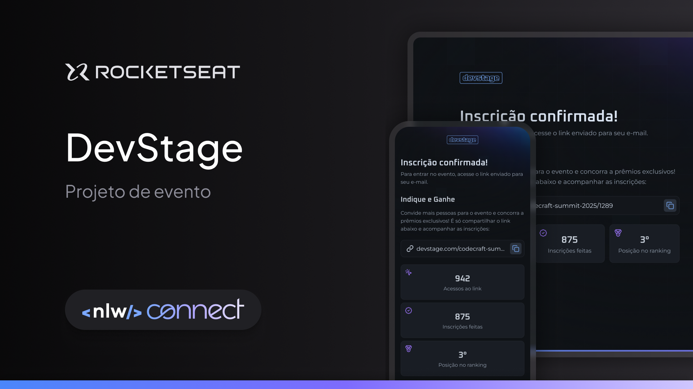

# NLW CONNECT - Trilha React

## 📌 Sobre o projeto 

O NLW CONNECT é um sistema de referência e indicação de contatos, desenvolvido para demonstrar conceitos avançados de React e Next.js. Durante a imersão, consumimos uma API para exibir dinamicamente os dados, permitindo que os usuários interajam com a plataforma de forma intuitiva.

## Stack utilizada

🛠️ **Front-end:** 
- Next.js – Framework para React com renderização server-side.
- TailwindCSS – Estilização com classes utilitárias.
- Zod – Validação de dados.

## Como Executar o Projeto
**Pré-requisitos:**

Antes de começar, você precisa ter instalado:

- Node.js (recomendado: v16 ou superior)
- Gerenciador de pacotes: npm ou yarn

## 📌 Funcionalidades

✅ Sistema de cadastro e indicação de referências.

✅ Integração com API para exibição dinâmica de dados.

✅ Interface moderna e responsiva com TailwindCSS.

## Licença

[MIT](https://choosealicense.com/licenses/mit/)

